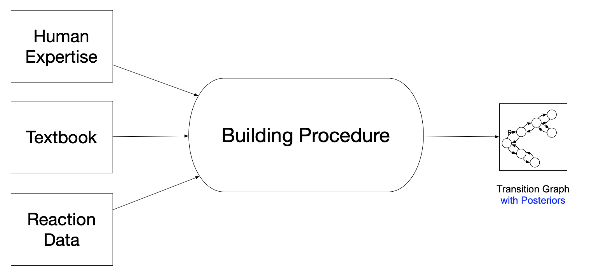
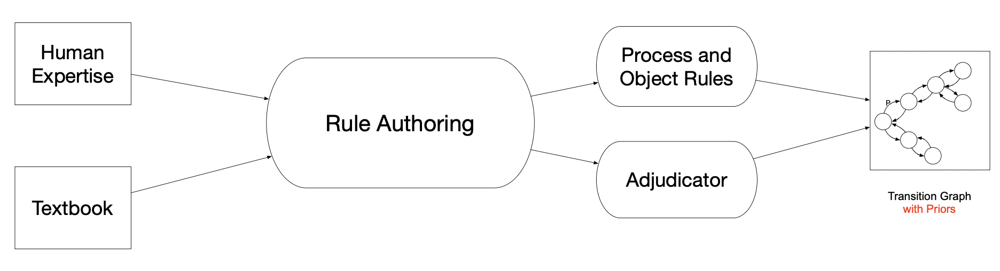
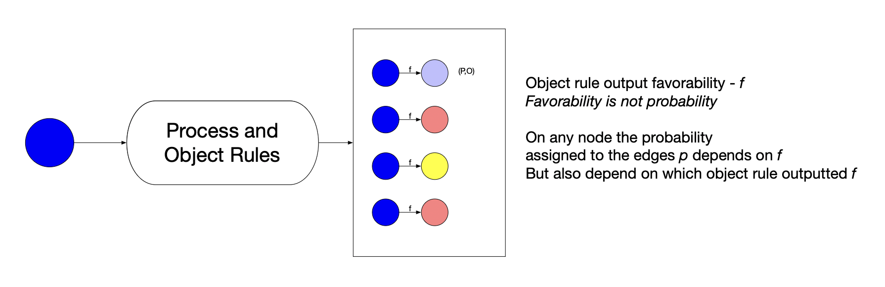
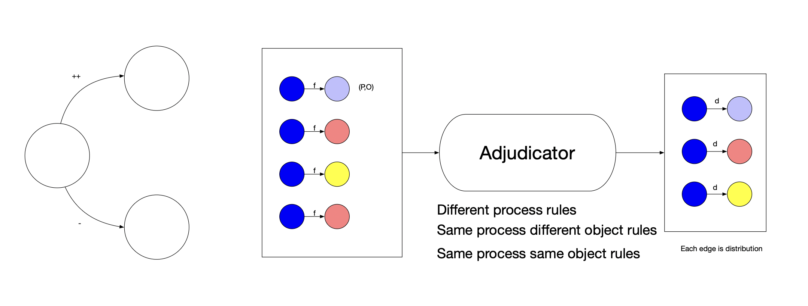
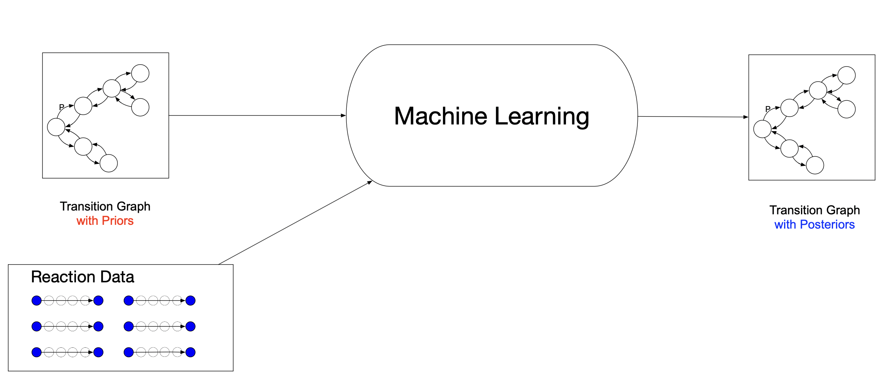
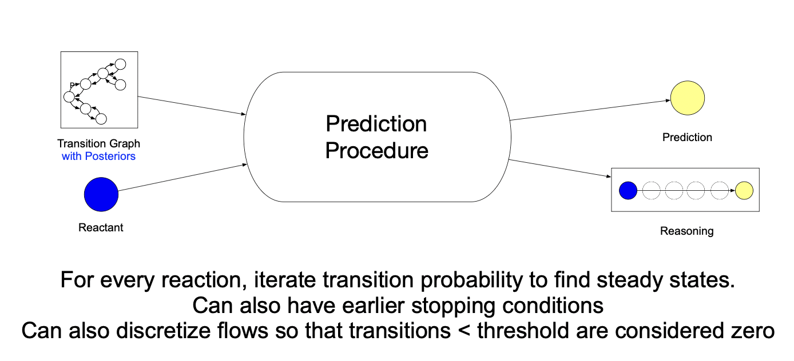

# Overview
At a bird's-eye view, the Computable Model of the Chemistry Textbook (CMT) takes:
- Human expertise
- Textbook knowledge
- Reaction data (e.g., USPTO)

and builds a transition graph that can be used to make predictions on reaction outcomes.

## The Building Procedure
The first component of the building procedure, and one that this repo is implementing primarily, is translating textbook chemistry knowledge about chemical mechanisms into **process rules** and **object rules**, which return favorability scores that are turned into transition graphs via an **adjudicator**.

Given a set of reactants, the **process rules** generate a set of candidate transformations proposed by mechanisms encoded in chemistry textbooks, and the **object rules** assess the favorability of each candidate transformation.

The **adjudicator** then translates these favorability assessments into a probability distribution over the outgoing transformation edges. The resulting transition graph can be seen as the **inductive prior** of textbook and human expertise.

Finally, given real-life reaction data, we fit/update the inductive prior transition graph to generate the final CMT graph that represents our posterior belief.

## The Prediction Procedure

When making new predictions at inference-time, we can use the posterior transition graph to find steady states which correspond to the predicted set of reaction products.

